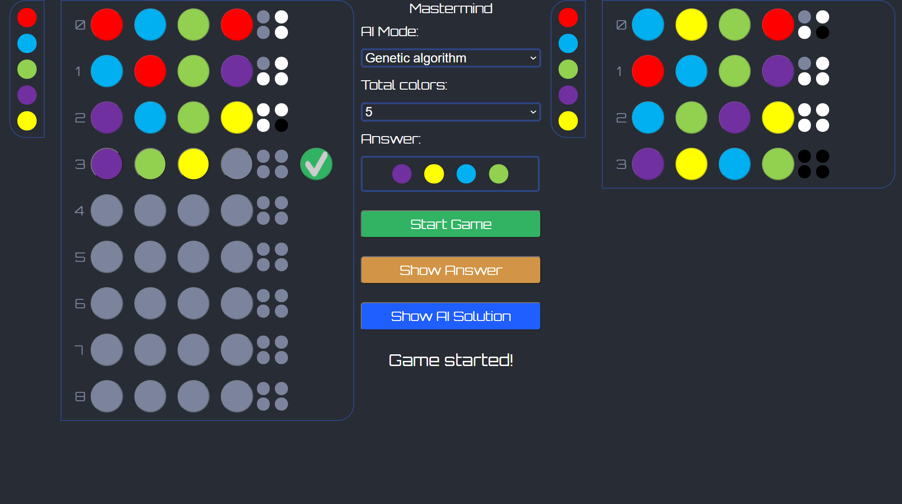

[](https://opensource.org/licenses/MIT)


# Mastermind

Mastermind is a classic problem-solving game that challenges players identify patterns and respond to turn feedback in a bid to guess the hidden sequence of colors. This application implements 2 algorithms to solve the game of Mastermind. First, a naive solver that solves the colors iteratively by slot. Second, a genetic algorithm inspired by [Dungyichao's Python implementation](https://github.com/Dungyichao/Mastermind), reimplemented and modified in JavaScript. The application is built using the [React framework](https://github.com/facebook/react) and hosted on GitHub pages [here](glennchia.github.io/mastermind-react/). Users can start games with 2 settings (a pool of 5 or 6 colors) and pit their solving skills against the naive and genetic algorithm solvers.

# Navigation

1. [User interface](#UI)
2. [Running the application locally](#RUNLOCALLY)
3. [Deployment to GitHub pages](#DEPLOY)
4. [Contributing](#CONTRIBUTING)

# User interface <a name="UI"></a>



# Running the application locally <a name="RUNLOCALLY"></a>

Run the following to start the app locally:

```bash
npm install
npm run start
```

# Deployment to GitHub pages <a name="DEPLOY"></a>

This static site is deployed to GitHub pages. Run:

```bash
npm run deploy
```

# Contributing <a name="CONTRIBUTING"></a>

Before making commits, lint the code

```bash
npm run lint:fix
```